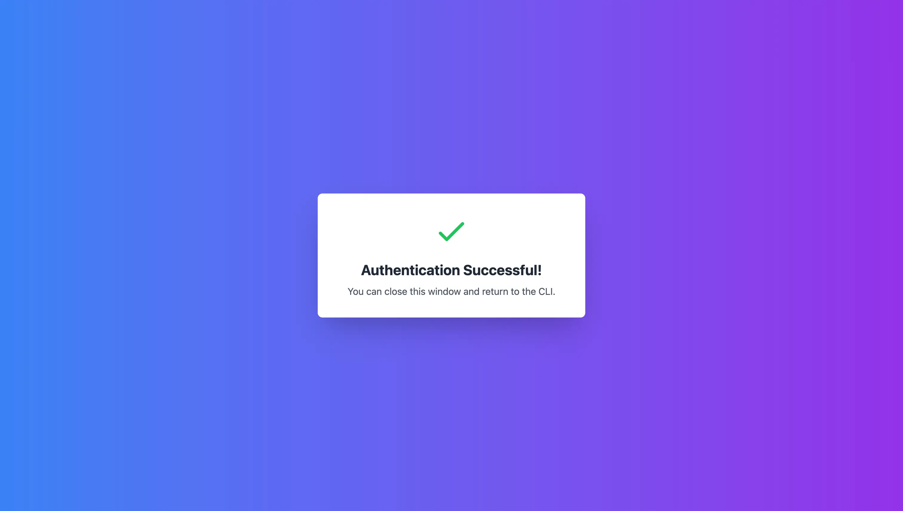

# OAuth CLI Demo

A runnable demo of browser-based OAuth authentication flows in command-line applications, powered by [WorkOS](https://workos.com) [AuthKit](https://authkit.com).


## Features

- 🔐 Secure browser-based OAuth authentication
- 🔒 WorkOS AuthKit integration
- 💾 Persistent token storage in system keychain
- 🎨 Stylized authentication successful page 



## Installation

```bash
# Clone the repository
git clone https://github.com/zackproser-workos/cli-auth-example.git
cd oauth-cli-demo
# Install dependencies
npm install
# Set environment variables
cp .env.example .env.local
```

## Configuration

Add your WorkOS credentials to `.env.local`:

```plaintext
WORKOS_CLIENT_ID=client_xxxxxxxxxxxx
WORKOS_API_KEY=sk_xxxxxxxxxxxx
# Optional: Set a custom token directory or leave unset to use default: ~/.workos
WORKOS_TOKEN_DIR=/path/to/token/directory
```

## Usage

```bash
# Build the CLI
npm run build

# Run the login command
npm start login
```

The CLI will:
1. Launch your default browser for authentication
2. Start a local server to capture the OAuth callback
3. Securely store the access token in your system keychain
4. Display a real-time animation of the authentication progress

## Development

```bash
# Run in development mode
npm run dev

# Build the project
npm run build

# Run the built version
npm start
```

## How It Works

This CLI demonstrates the common pattern used by tools like GitHub's CLI (`gh`) for authentication:

1. The CLI initiates an OAuth flow by starting a local server
2. It launches the user's browser to the WorkOS AuthKit authentication page
3. After successful authentication, WorkOS redirects to the local server
4. The CLI exchanges the authorization code for an access token
5. The token is securely stored in the system keychain for future use

## Security

- OAuth tokens are stored securely using system keychain integration
- Environment variables are strictly validated
- Local server only accepts connections from localhost
- HTTPS is used for all OAuth token exchanges

## Contributing

1. Fork the repository
2. Create your feature branch (`git checkout -b feature/amazing-feature`)
3. Commit your changes (`git commit -m 'Add some amazing feature'`)
4. Push to the branch (`git push origin feature/amazing-feature`)
5. Open a Pull Request

## WorkOS CLI OAuth Demo

## Configuration

The CLI can be configured using environment variables:

| Variable | Required | Default | Description |
|----------|----------|---------|-------------|
| WORKOS_API_KEY | Yes | - | Your WorkOS API Key |
| WORKOS_CLIENT_ID | Yes | - | Your WorkOS Client ID |
| WORKOS_TOKEN_DIR | No | ~/.workos | Directory where the authentication token will be stored |

## Token Storage

By default, the CLI stores the authentication token in `~/.workos/token`. You can customize this location by setting the `WORKOS_TOKEN_DIR` environment variable.

### Custom Token Directory

To use a custom directory for token storage:

```bash
export WORKOS_TOKEN_DIR=/custom/path/to/token/directory
```

## Testing

The project includes a comprehensive test suite using Jest. You can run tests using the following commands:

```bash
# Run all tests
npm test

# Run tests in watch mode (useful during development)
npm run test:watch

# Run tests with coverage report
npm run test:coverage
```

Test files are located in `src/__tests__/` and follow the naming convention `*.test.ts`. The suite includes tests for:
- OAuth authentication flow
- Token storage and retrieval
- Environment variable validation
- UI components

## Usage Example

Running `npm start login` will start the authentication flow:

```console
   ╭───────────────────────────────╮
   │                               │
   │   WorkOS CLI Authentication   │
   │                               │
   ╰───────────────────────────────╯

⠋ Starting authentication flow...
→ Local server started
→ Opening browser for authentication
⠋ Waiting for authentication...
→ Received authorization code
⠼ Processing authentication...

✓ Authentication successful

Token Storage Details:
📁 Created new directory: /Users/zachary/.workos
💾 Token saved to: /Users/zachary/.workos/token

🔍 View token contents with:
   cat ~/.workos/token
```

This will:
1. Start a local server
2. Open your browser for WorkOS authentication
3. Process the authentication response
4. Save your access token locally
